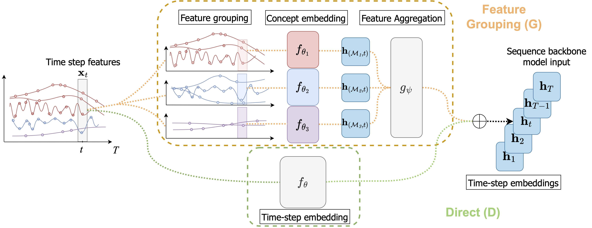

# On the Importance of Step-wise Embeddings for Heterogeneous Clinical Time-Series

Paper: https://proceedings.mlr.press/v225/kuznetsova23a.html



## Setup

We provide a `conda` environment file: `environment.yml`. To create the environment, run:

```bash
conda env create -f environment.yml # create the conda environment

conda activate embeddings # activate the environment

pip install -e . # install the package
```

## Data and Preprocessing 

We base our pipeline on the work of Yèche et al. in Temporal Label Smoothing. For instructions on
how to obtain access to the [MIMIC-III](https://physionet.org/content/mimiciii/1.4/) and [HiRID](https://physionet.org/content/hirid/1.1.1/) datasets, as well as how to preprocess them, please
consult the repository here: [https://github.com/ratschlab/tls](https://github.com/ratschlab/tls).

The `tls` repository with the preprocessing is included as a submodule in this repository. To clone the repository with the submodule, run:

```bash
git submodule init
git submodule update

# follow instructions in `tls` repository to download and preprocess the datasets
```

The resulting `.h5` files in the `ml_stage` working directory of the preprocessing are the designated
inputs to our pipeline.

### Tasks

| Dataset  | Task | Time-Series Length | Target Dimension | Shorthand |
| ------------- | ------------- |------------- |------------- |------------- |
| HiRID  | Circulatory Failure at 12h Horizon | 2016 timepoints, 1 week | 2 | `Dynamic_CircFailure_12Hours` |
| HiRID  | Respiratory Failure at 12h Horizon | 2016 timepoints, 1 week | 2 |  `Dynamic_RespFailure_12Hours` |
| HiRID  | Mortality after 24h | 288 timepoints, 24 hours | 2 |  `Mortality_At24Hours` |
| HiRID  | Remaining Length of Stay | 2016 timepoints, 1 week | 1 |  `Remaining_LOS_Reg` |
| HiRID  | Phenotyping after 24 hours | 288 timepoints, 24 hours | 15 |  `Phenotyping_APACHEGroup` |
| MIMIC-III  | Decompensation in next 24h | full time-series | 2 |  `decomp_24Hours` |
| MIMIC-III  | In-Hospital Mortality after 48h | 48 timepoints, 48 hours | 2 |  `ihm` |
| MIMIC-III  | Length of Stay | full time-series | 1 |  `los` |

### Auxiliary Files

In the folder: `./files/cat_dicts/` we provide the auxiliary files for the MIMIC-III and HiRID datasets, which are used to map the categorical variables to their respective indices. They are
used in the Feature Tokenizer embedding layer. An example on how to use/pass these is in: `./configs/examples/hirid/embeddings/ftt-prior-group/transformer.gin`.

In the  folder `./files/dataset_stats/` we provide the auxiliary files for the MIMIC-III and HiRID datasets, which provide dataset statistics and most importantly the directory stores the different variable groupings (e.g. Organ System, Variable Type, ...). The priors are stored as lists of lists of variable indeces. An example on how
to call them by name via the `run_wrapper.py` (see below) in the sweep `.yaml` is provided in `./configs/reproduce/embeddings/ftt-prior-group/transformer_ftt_prior_group_circulatory.yaml`.

## Training

The core code of the models is located in `icu_benchmarks/models/encoders.py`, `icu_benchmarks/models/layers.py`, and  `icu_benchmarks/models/wrappers.py`.

We use [`.gin` configuration](https://github.com/google/gin-config) files to specify the hyperparameters of the models. The configuration files for the models used in the paper are located in `configs/`.

To do a training run, modify the chosen configuration file to point to the correct input files by setting `train_common.data_path` and `TASK` (HiRID: `Mortality_At24Hours, Dynamic_CircFailure_12Hours, Dynamic_RespFailure_12Hours, Remaining_LOS_Reg, Phenotyping_APACHEGroup`, MIMIC: `decomp_24Hours, ihm, los`) to the desired task to solve for (refer to [https://github.com/ratschlab/tls](https://github.com/ratschlab/tls)). Note that for mortality predictions the time-series should be appropriately cut and the configurations need to be adapted for this taking into account the grid resolution of the respective datasets (5min for HiRID, 1h for MIMIC). For `ihm` on MIMIC set `MAXLEN=48`. For `Mortality_At24Hours` and `Phenotyping_APACHEGroup` on HiRID set `MAXLEN=288 # 12 * 24`. Set the `NUM_CLASSES` output dimension modifier with the corresponding entry of the *Target Dimension* column in the Task table. For `Phenotyping_APACHEGroup` one should additionally train with `LOSS_WEIGHT = 'balanced'`. Then, run:

```bash
 accelerate launch \
    --config_file ./configs/accelerate/accel_config_gpu1.yml \
    ./icu_benchmarks/run.py train \
    -c ./configs/examples/hirid/backbone/GRU.gin \
    -l logs/backbone_GRU
```

We use [HuggingFace Accelerate](https://huggingface.co/docs/accelerate/index) for launching (distributed) training runs. The configuration file `accel_config_gpu1.yml` is provided in `configs/accelerate/` and specifies the number of GPUs to use. The `train` command will create a new directory in `logs/` with the name specified by the `-l` argument. The training logs, performance results on validation and test, as well as checkpoints will be saved in this directory. `-c` specifies the path to the configuration file.

Please note that some of the example use very small model dimension for demonstration purposes. To reproduce the results from the paper, please refer to the search space configuration files (`.yaml`) in `configs/reproduce/*`.

### Hyperparameter Search

We use a [Slurm](https://slurm.schedmd.com) based compute cluster and provide a wrapper script (`./run_wrapper.py`) to launch hyperparameter sweeps (for a different compute environment core functions to modify are `create_slurm_command` and `run_on_slurm`). The script takes a configuration file (`.yaml`) as input and launches a hyperparameter sweep based on the specified search space. Individual run directories are created in the designated directory and the runs are submitted to the cluster. The wrapper creates dedicated `.gin` configurations in each run directory, which extend and overwrite the base configuration. The configuration file should specify the following parameters:

```yaml
# Specify compute resources
compute:
  gpus: 1 # Number of GPUs (should align with the number of GPUs in the accelerate config file)
  gpu_type: rtx2080ti # Type of GPU
  cores: 4 # Number of CPU cores, specify the number of workers in the gin config file
  memory: 4 # Amount of memory in GB per core
  time: 4 # Time in hours

# Hyperparameters
# Specify hyperparameters to be tuned and their search space
# Specify them exactly as they are specified in the gin config file
params:

  # Some examples, keys should be exactly as if provided via gin configurations
  # they will be copied into the gin config file
  # If a single value is provided the value will be added as is to the gin configuration file
  # If a list is provided, it will be considered a search parameter and the corresponding
  # configurations are created by the run_wrapper.py script
  Transformer.hidden: 231
  Transformer.depth: [1, 2, 3]
  Transformer.heads: [1, 2, 3]
  Transformer.dropout: [0.0, 0.1, 0.2]

  Adam.lr: [0.0001, 0.0005, 0.001]


# Different Random Seeds (one run per seed will be launched)
seeds: [1111, 2222, 3333]

base_gin: './configs/examples/hirid/backbone/transformer.gin' # the gin config file to be used as a base
accelerate_config: './configs/accelerate/accel_config_gpu1.yml' # the accelerate config file to be used
task: 'Dynamic_CircFailure_12Hours' # the task to be run
```

To launch a hyperparameter sweep, run:

```bash
python run_wrapper.py \
    --config ./configs/examples/hirid/backbone/transformer_base.yaml \ # Base config file
    --shuffle \ # Shuffle the hyperparameter combinations, together with `num_runs` this creates a random search
    --num_runs 20 \ # Maximun number of different configurations to be run, if not set, all possible combinations are run
    --directory ./logs # Directory to save the sweep in
    --name example-sweep # Name of the sweep (corresponds to folder name) inside provided directory
```

### Reproduction

We provide a set of configurations in `./configs/reproduce` in the form of `.yaml` sweep config files and their associated `.gin` base config files.

## Citation

```bibtex
@InProceedings{pmlr-v225-kuznetsova23a,
  title = 	 {On the Importance of Step-wise Embeddings for Heterogeneous Clinical Time-Series},
  author =       {Kuznetsova, Rita and Pace, Aliz\'ee and Burger, Manuel and Y\`eche, Hugo and R\"atsch, Gunnar},
  booktitle = 	 {Proceedings of the 3rd Machine Learning for Health Symposium},
  pages = 	 {268--291},
  year = 	 {2023},
  editor = 	 {Hegselmann, Stefan and Parziale, Antonio and Shanmugam, Divya and Tang, Shengpu and Asiedu, Mercy Nyamewaa and Chang, Serina and Hartvigsen, Tom and Singh, Harvineet},
  volume = 	 {225},
  series = 	 {Proceedings of Machine Learning Research},
  month = 	 {10 Dec},
  publisher =    {PMLR},
  pdf = 	 {https://proceedings.mlr.press/v225/kuznetsova23a/kuznetsova23a.pdf},
  url = 	 {https://proceedings.mlr.press/v225/kuznetsova23a.html}
}
```
